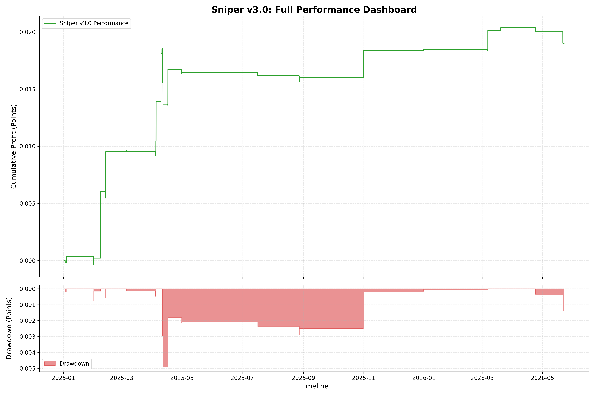

# 🎯 Sniper v3.0: High-Performance FX Mean Reversion Engine

**Sniper v3.0** is an end-to-end quantitative trading system for EURUSD (M1) that bridges the gap between theoretical research and execution reality. It utilizes **Numba-accelerated GPU kernels** for high-speed backtesting and an **XGBoost probabilistic filter** to refine entry quality.

---

## 🧠 Philosophy: Built on "Market Scars"
Most retail bots are built on vanity metrics. Sniper v3.0 is built on the hard-earned lessons of past failures—liquidations, slippage traps, and counterparty risks.

* **Survivor Mindset**: Prioritizes capital preservation (**Max Drawdown**) over raw profit.
* **Execution First**: Designed specifically to handle real-world frictions like **spread widening** and **latency**.
* **Anti-Fragility**: Validated through rigorous stress testing to ensure the strategy survives market regime shifts.

---

## ⚙️ Engineering & Tech Stack
* **GPU Parallel Computing**: Leverages **Numba (CUDA)** to process 4,000,000+ rows of M1 data in seconds, moving beyond CPU bottlenecks.
* **Machine Learning**: An **XGBoost Classifier** acts as a binary gatekeeper, allowing trades only when the historical probability of success exceeds **70%**.
* **Infrastructure**: Modular Python architecture with a dedicated **Live Executor** for MetaTrader 5 API integration.

---

## ⚔️ Strategy Logic (Triple-Barrier Method)
The strategy exploits short-term mean reversion inefficiencies with a strict exit framework:

* **Entry**: Signal triggered at $Z\text{-Score} > 2.2$ combined with high AI confidence.
* **Dynamic Take Profit**: Aggressive exit at $3.5 \times ATR$.
* **Defensive Stop Loss**: Tight protection at $1.5 \times ATR$.
* **Time Barrier**: Hard exit after **6 minutes** to prevent holding through noise.

---

## 📊 Performance & Risk Dashboard
*Historical Backtest (2015 - 2026) | Symbol: EURUSD (M1)*

| Metric | Value |
| :--- | :--- |
| **Profit Factor** | **1.887** |
| **Recovery Factor** | **> 16.0** |
| **Max Drawdown (Hist)** | **-0.0058 Points** |
| **95% Confidence DD** | **-0.0111 Points** |

---

## 📈 Equity Growth & Drawdown Intensity

*Figure 1: 11-year equity curve showing consistent growth and rapid recovery from drawdowns.*

## 🛡️ Monte Carlo Robustness Analysis (5,000 Paths)
To ensure the strategy is not curve-fitted, we randomized trade sequences to simulate 5,000 alternative futures.

*Figure 2: Probability distribution of returns, confirming a high survival rate across randomized regimes.*

---

## 🚀 Quick Start

```bash
pip install -r requirements.txt
cp config/settings.py.example config/settings.py
cp .env.example .env

# Build M1 data from Dukascopy ticks
python scripts/00_ticks_to_m1.py

# Train models
python scripts/02_train_ml.py

# Auto-optimize strategy parameters (writes best params to .env)
# Use v1.0 for enhanced logic (true ATR, session filter, MTF confirmation)
python scripts/04_optimize_v1.0.py --target 1.2 --trials 500

# Backtest with optimized params
python scripts/03_backtest_v1.0.py
```

## ⚙️ Configuration

Strategy parameters (`Z_THRESHOLD`, `ML_PROB_LIMIT`, ATR multipliers, etc.) live in `.env` at the project root. Running `04_optimize.py` writes the best parameters there automatically — no manual editing needed. See `.env.example` for all supported keys.

## 📁 Repository Structure
```text
├── config/
│   ├── settings.py            # Loads .env, exposes all config as constants (gitignored)
│   └── settings.py.example    # Committed template — copy to settings.py
├── core/
│   ├── kernels.py             # Numba @cuda.jit kernel — Z-Score + ATR in one GPU pass
│   └── metrics.py             # Net profit, profit factor, max drawdown
├── scripts/
│   ├── 00_ticks_to_m1.py      # Dukascopy tick parquets → M1 OHLCV parquet
│   ├── 01_preprocess.py       # Raw CSV → parquet (alternative to 00)
│   ├── 02_train_ml.py         # GPU feature engineering + XGBoost training (4 timeframes)
│   ├── 03_backtest.py         # Baseline backtest — vectorized, single TF
│   ├── 03_backtest_v1.0.py    # Enhanced backtest — true ATR, session filter,
│   │                          #   dynamic spread, concurrent-trade guard, MTF confirm
│   ├── 04_optimize.py         # Optuna optimizer for 03_backtest.py → writes .env
│   └── 04_optimize_v1.0.py    # Optuna optimizer for 03_backtest_v1.0.py → writes .env
├── models/                    # gitignored
│   ├── 1MIN/MREV_1MIN_v1.json
│   ├── 5MIN/MREV_5MIN_v1.json
│   ├── 15MIN/MREV_15MIN_v1.json
│   └── 30MIN/MREV_30MIN_v1.json
├── data/                      # gitignored
│   ├── raw/                   # Source CSV files (e.g. EURUSD_M1_Combined_2015_2026.csv)
│   └── processed/
│       ├── eurusd_m1.parquet          # Built by 00_ticks_to_m1.py or 01_preprocess.py
│       ├── EURUSD_M1_*.parquet        # Sample / partial datasets
│       └── YYYY/MM/DD/ticks.parquet   # Dukascopy daily tick files (input for 00_ticks_to_m1.py)
├── output/plots/              # Generated dashboard PNGs
├── .env                       # Tuned strategy parameters — auto-written by optimizer (gitignored)
├── .env.example               # Documents all supported .env keys with defaults
└── requirements.txt
```

---

##⚖️ License
This project is licensed under the MIT License—free for educational and research use.

